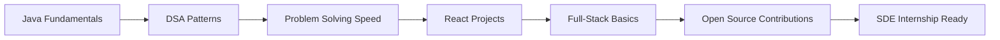

```text
Learn the concept
      ↓
Build a small version
      ↓
Refactor for clarity
      ↓
Document the approach
      ↓
Ship it publicly
```

I use projects as proof of learning. Every repository is a chance to improve structure, naming, documentation, UI polish, and problem-solving discipline.

---

## GitHub Analytics

<div align="center">


<br/>
<br/>


</div>

---

## Contribution Activity

<div align="center">

[](https://github.com/lavanyaag23)

</div>

---

## GitHub Trophies

<div align="center">


</div>

---

## Learning Roadmap



| Track | Topics |
|---|---|
| Java DSA | Arrays, Strings, Recursion, OOP, Trees, Graphs, Dynamic Programming |
| React | Components, props, hooks, state, forms, routing, project structure |
| Web Fundamentals | Semantic HTML, responsive CSS, DOM, accessibility basics |
| Full-Stack Basics | APIs, auth flow, database concepts, deployment |
| Open Source | Issues, pull requests, clean commits, collaboration workflow |

---

## 2026 Goals

| Goal | Status |
|---|---|
| Solve 200+ DSA problems | In Progress |
| Complete 100 Days of Code | In Progress |
| Strengthen Java fundamentals | In Progress |
| Build 3+ full-stack projects | In Progress |
| Contribute to open source | In Progress |
| Secure an SDE internship | Target |

---

## Current Practice Loop

```text
DSA problem of the day
Frontend implementation practice
Project improvement or documentation
GitHub commit with clear message
Weekly review of progress and gaps
```

---

## Connect With Me

<div align="center">

[](https://github.com/lavanyaag23)
[](https://linkedin.com/in/lavanya-agrawal-06b57b320)
[](https://lavanyaagrawal.vercel.app)
[](mailto:lavanyaagrawal259@gmail.com)

</div>

---

<div align="center">


<b>Always learning, always building, always improving.</b>

</div>
